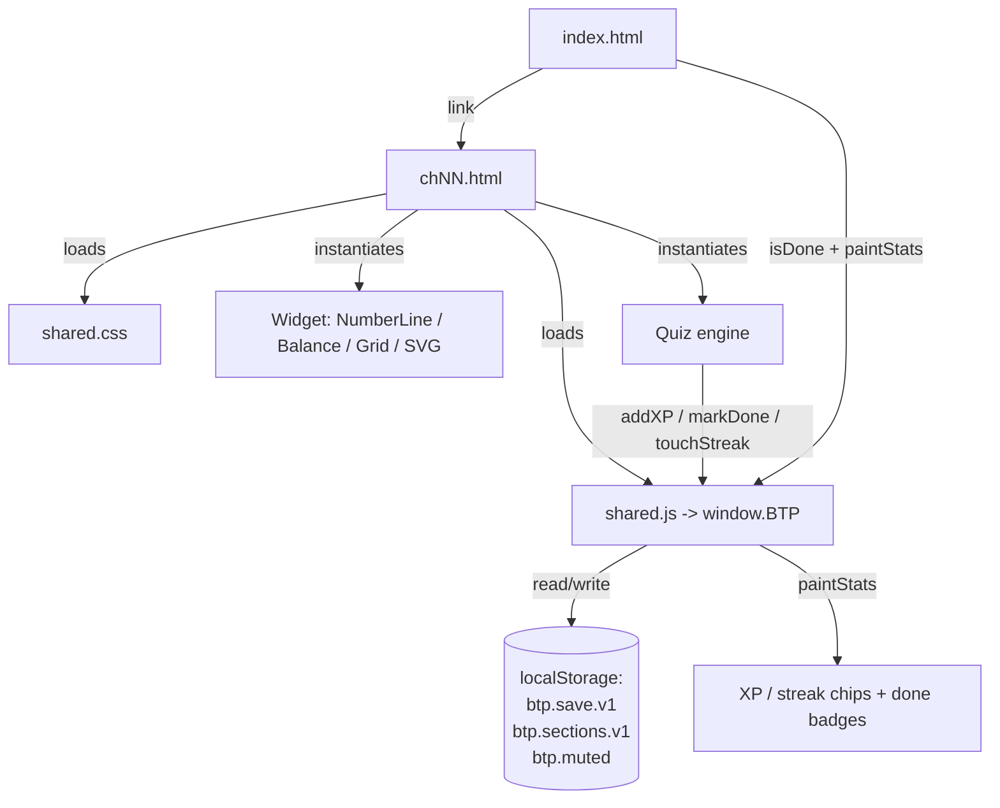

# Hiromatics — Design Document

A browser-based, interactive math learning site for Grade 7 (NCERT
*Ganita Prakash*). Each textbook chapter becomes a small playable page:
something to zoom into, drag, or experiment with, followed by a quiz
drawn from the textbook.

**Design goals**
- **Zero dependencies, zero build.** Plain HTML + CSS + one JS file.
  Open `index.html` in any modern browser and it runs.
- **One shared design system.** Every page links the same `shared.css`
  and `shared.js`, so all chapters look and behave consistently.
- **Learn-by-doing first, quiz second.** Every chapter leads with a
  manipulable widget before testing recall.
- **Progress that persists.** XP, streak, and per-section mastery are
  stored in `localStorage`, shared across all chapters (same origin).

---

## 1. File Layout

```
index.html        Landing page / chapter picker
shared.css        Design system: palette, components, widgets, animations
shared.js         Runtime library — everything lives on window.BTP
ch01.html … ch15.html   One self-contained page per chapter (15 pages)
ch05_learn.png    Supporting image asset for chapter 5
README.md         Project overview
LICENSE           MIT
```

### Page anatomy

- **`index.html`** — declares two chapter arrays (`PART1`, `PART2`),
  renders them as `.chapter-card` links, and paints saved stats. A card
  shows a "✓ done" badge when `BTP.isDone(chapterId)` is true.
- **`chNN.html`** — self-contained chapter. Structure:
  1. `<header>` with brand/back link and `#streak` / `#xp` chips.
  2. `<nav>` of `.tab` buttons switching between panels
     (e.g. *Explore/Zoom*, *Find It*, *Challenge*).
  3. One `<section class="panel">` per tab.
  4. A `<script>` block with chapter-specific logic that consumes `BTP`
     widgets and the quiz engine.

---

## 2. Runtime Library (`window.BTP`)

`shared.js` is an IIFE-structured namespace. All public API is attached to
the global `BTP` object. Sections:

| # | Area | Key API |
|---|------|---------|
| 1 | **Save / XP / Streak** | `BTP.addXP(n)`, `BTP.touchStreak()`, `BTP.paintStats()`, `BTP.markDone(id)`, `BTP.isDone(id)`, `BTP.save` (read-only peek) |
| 2 | **Misc utils** | `BTP.toast(msg)`, `BTP.shuffle(arr)`, `BTP.pick(arr)`, `BTP.indianCommas(n)`, `BTP.say(n)`, `BTP.numberName(n)` |
| 3 | **Quiz engine** | `BTP.setupQuiz(QUESTIONS, opts)` |
| 3B | **Section quiz engine** | `BTP.setupSectionQuiz(SECTIONS, opts)` |
| 4 | **Number line widget** | `BTP.NumberLine(config)` |
| 5 | **Balance widget** (algebra) | `BTP.Balance(containerId)` |
| 6 | **Grid widget** (fractions/HCF) | `BTP.Grid(containerId, rows, cols)` |
| 7 | **SVG / drag helpers** (geometry) | `BTP.svgEl`, `BTP.dragPoint`, `BTP.dist`, `BTP.angleDeg` |
| 8 | **Mascot** | `BTP.Mascot(containerId, opts)` |
| 9 | **Feedback animations** | `BTP.confetti(x, y)`, `BTP.shakeEl(el)` |
| 10 | **Sound** | `BTP.sound.click/right/wrong/celebrate`, `BTP.sound.isMuted/setMuted` |

### 2.1 Persistence model

Two `localStorage` keys, both origin-shared across every page:

- **`btp.save.v1`** → `{ xp, streak, lastDay, done:{ chId:true } }`.
  Drives the XP/streak chips and the "done" badges on the picker.
- **`btp.sections.v1`** → `{ "chId::secId": { pct, passed } }`.
  Per-section best score and mastery, used by the section quiz engine.
- **`btp.muted`** → `"1"` / `"0"` for the sound toggle.

Loading is defensive: corrupt or first-run data falls back to sane
defaults rather than throwing.

**Streak logic:** `touchStreak()` compares `lastDay` to today; a
consecutive-day visit increments the streak, a gap resets it to 1, and
same-day calls are no-ops.

### 2.2 Quiz engines

Two complementary engines share the same DOM ids (`#qbar`, `#qq`,
`#qopts`, `#qfb`, `#qnext`, …) so a chapter picks one:

- **`setupQuiz(QUESTIONS, opts)`** — one shuffled run of N questions
  (default 6). Awards `xp` per correct answer, shows a "Chapter cleared"
  screen, and marks the chapter done at ≥60%. Options can supply a per-
  answer hook (`onAnswer(correct, btnEl)`) for mascot/confetti reactions.

- **`setupSectionQuiz(SECTIONS, opts)`** — a menu of per-textbook-section
  quizzes. Each section needs **80%** (configurable) to be "mastered".
  Distinctive feature: **same-concept follow-ups** — a wrong answer can
  splice a second question on the same idea immediately after, so a miss
  can't just be clicked past. Chapter is marked done only when every
  section is mastered.

Both engines re-shuffle both the question order and the option order on
each run, remapping the correct-answer index accordingly.

### 2.3 Widgets

- **`NumberLine(config)`** — a zoomable/pannable `<canvas>` number line
  with a `requestAnimationFrame` render loop that eases the current view
  toward a `goal` window. One engine serves three chapter families via
  config only: decimals (zoom **in** → tenths/hundredths), large numbers
  (zoom **out** → thousands/lakhs), and integers (negative domain).
  Supports mouse drag, wheel zoom, touch pan, and pinch zoom. Exposes
  `x2v`/`v2x` conversions, `setMarker`/`setGhost` for answer feedback, and
  `onTap`/`onFrame` callbacks. Multi-level ticks fade in as spacing allows
  (`levelAlpha`), and labels render only when they measurably fit.

- **`Balance(containerId)`** — a two-pan scale for algebra chapters.
  `render(leftItems, rightItems)` tilts the beam toward the heavier side;
  purely visual, chapter code owns what "solving" means. Unit (known)
  items render cyan, variable (unknown) items render violet.

- **`Grid(containerId, rows, cols)`** — a cell grid for fraction bars,
  area models (distributive property), and factor/HCF-LCM visuals.
  Exposes `cells[r][c]`, `fillCount(n, cls)`, and `clear()`.

- **SVG helpers** — deliberately *not* a monolith. Build the `<svg>`
  yourself inside a `.stage`; use `svgEl(tag, attrs)` to create nodes and
  `dragPoint(svg, el, onDrag)` to make points draggable in viewBox units.
  Used by geometry chapters (parallel lines, triangles, congruence,
  tilings).

- **`Mascot(containerId, opts)`** — an **original** character (not a
  licensed one) rendered as inline SVG. Reacts with `say()`,
  `react("happy"|"sad"|"idle")`. Styled by a **named theme** the chapter
  picks explicitly, or a raw palette object (see 2.5).

### 2.4 Feedback & sound

- **Confetti + shake** are generic DOM/CSS effects triggered from quiz
  hooks.
- **Sound** is synthesized live with the Web Audio API — no sampled or
  licensed audio. A soft blip on any button (wired once via a capturing
  document listener), an ascending arpeggio for correct answers, a gentle
  two-note dip for wrong ones, and a fanfare for mastering a section. A
  mute toggle auto-mounts into any page's `.stats` row; state persists.

### 2.5 Mascot themes

Each chapter has its **own fixed mascot** — a distinct original character.
There is **no global picker**; a chapter names its theme explicitly when it
mounts the mascot, so every page always shows the same buddy.

```js
BTP.Mascot("box", "forest");   // explicit theme (the normal call)
BTP.Mascot("box", { theme:"forest", color:"#abc" }); // theme + overrides
const m = BTP.Mascot("box", "aqua");
m.say("hi!", 4200);            // speech bubble; react("happy"|"think"|…)
```

- **Per-chapter, not global.** No theme is stored in the save blob and no
  index-page selector exists. Chapters pass a theme string directly.
- **`BTP.MascotThemes`** maps a theme name → preset
  `{ color, accent, accent2, earStyle, name }`. `name` is only a suggested
  default; chapter dialogue never states a character name, so a theme is a
  pure *look*.
- **Precedence:** built-in defaults < theme preset < explicit `opts`.
- **Ear styles:** `dot` (default), `hood`, `bow`, `band` (blank ninja
  headband + pointed ears), `spark` (lightning ears + cheek sparks),
  `hat` (straw hat), `forest` (tall pointed ears + whiskers). No ear style
  carries a franchise crest/logo.
- **Register your own:**
  `BTP.MascotThemes.myTheme = { color, accent, accent2, earStyle, name }`.

**Theme registry** (all franchise-*inspired* originals, aesthetic only):

| Theme | Character | Vibe |
|-------|-----------|------|
| `kawaii` | Suzu | Sanrio-style pastel + bow |
| `ninja` | Kata | Naruto-style headband |
| `spark` | Voltling | Pokémon-style electric critter |
| `pirate` | Pip | One Piece-style straw hat |
| `imp` | Riko | Kuromi-*inspired* mischief hood |
| `forest` | Grove | Totoro-*inspired* woodland spirit |
| `aqua` | Dot | bright cyan explorer |
| `shadow` | Nyx | moody violet hood |
| `ocean` | Nilo | calm ocean blue |
| `mint` | Sprout | fresh green |
| `berry` | Momo | berry-pink hood |
| `stone` | Pochi | plain grey pup |

**Per-chapter assignment** (no two adjacent chapters repeat):

| Ch | Theme · Character | Ch | Theme · Character |
|----|-------------------|----|-------------------|
| 01 | `pirate` · Pip | 09 | `berry` · Momo |
| 02 | `spark` · Voltling | 10 | `ocean` · Nilo |
| 03 | `aqua` · Dot | 11 | `mint` · Sprout |
| 04 | `shadow` · Nyx | 12 | `aqua` · Dot |
| 05 | `kawaii` · Suzu | 13 | `pirate` · Pip |
| 06 | `imp` · Riko | 14 | `forest` · Grove |
| 07 | `ninja` · Kata | 15 | `shadow` · Nyx |
| 08 | `stone` · Pochi | | |

> **IP rule (hard constraint):** themes evoke *art styles* only. Never add
> a theme, name, colourway, or ear style that reproduces a licensed
> character, its name, or a crest/logo. Original characters inspired by a
> genre are fine; copies are not.

---

## 3. Design System (`shared.css`)

- **Theme:** dark, deep-space palette defined as CSS custom properties on
  `:root` (`--bg`, `--panel`, `--ink`, `--cyan`, `--violet`, `--amber`,
  `--green`, `--red`, radius `--r`). Change the theme in one place.
- **Layout:** `.wrap` caps content at 960px, centered, mobile-first with
  16px padding and a radial-gradient background.
- **Component classes** (shared vocabulary across all pages):
  - Chrome: `header`, `.brand`, `.back`, `.stats`, `.chip`, `nav`, `.tab`
  - Content: `.panel`, `.lede`, `.card` / `.readout`, `.levels`/`.lv`
  - Interactive stage: `.stage` (+`.tall`,`.drag`), `.zoombar`/`.zb`,
    `.hint`
  - Quiz: `.quest`, `.book`, `.opts`/`.opt` (+`.right`/`.wrong`), `.fb`
    (+`.good`/`.bad`), `.btn` (+`.ghost`), `.bar`
  - Picker: `.part-label`, `.chapters`, `.chapter-card`
  - Widgets: `.balance-*`, `.grid-*`, `.mascot*`, learn-slide helpers
  - Effects: `#toast`, `.confetti-piece`, `.shake-el`
- **Responsive:** grid columns collapse to a single column at ≤640px
  (cards) and ≤560px (quiz options).
- **Utilities:** `.hide` (force-hidden), `.on` (active tab/level/slide).

---

## 4. Conventions & Contracts

Chapter pages must honor a small contract so shared code works:

1. Include `#streak` and `#xp` elements in the header and call
   `BTP.paintStats()` on load (`addXP` repaints automatically).
2. To use a quiz engine, copy the exact id-based markup block
   (`#qbar`, `#qbox`, `#qsrc`, `#qq`, `#qm`, `#qopts`, `#qfb`, `#qnext`,
   `#qdone`/`#qscore`/`#qagain`, or the section-quiz equivalents).
3. Widgets are instantiated by passing element ids; the markup skeleton
   for each widget is documented in the corresponding `shared.js` section
   header comment.
4. Tab switching toggles `.hide` on `#p-<name>` panels and `.on` on the
   matching `.tab` button.
5. All strings use "use strict"; chapter logic runs in its own inline
   `<script>` after `shared.js` is loaded.

---

## 5. Data Flow



A correct quiz answer → `addXP` + `touchStreak` → save to `localStorage`
+ repaint chips. Section mastery / chapter completion → `markDone` →
picker shows the "done" badge on next visit.

---

## 6. Extension Guide — Adding a Chapter

1. Create `chNN.html`; copy the header, `<nav>`, and panel skeleton from
   an existing chapter of the closest type (number line / geometry /
   algebra / fractions).
2. Wire the relevant `BTP` widget(s) and a quiz engine, following the
   id-based markup contract.
3. Add an entry to `PART1` or `PART2` in `index.html`
   (`{ id, file, title, desc }`). Use `id` consistently as the
   `chapterId` passed to the quiz engine so the "done" badge lines up.
4. Mount a mascot: add `<div class="mascot-row"><div id="mascotChNN">`
   `</div></div>` in the first visible panel and call
   `BTP.Mascot("mascotChNN", "<theme>")` — pick a theme that isn't used by
   either neighbouring chapter (see §2.5 mapping).
5. No build step — reload the browser.

---

## 7. Non-Goals / Constraints

- No server, no backend, no accounts — progress is per-browser only.
- No third-party libraries or frameworks; keep the single-file-runtime
  model intact.
- All characters, chimes, and art are original (no licensed IP).
- Targets modern evergreen browsers (Canvas, Web Audio, Pointer Events,
  SVG, `localStorage`).

---

*Licensed under MIT. See `LICENSE`.*
